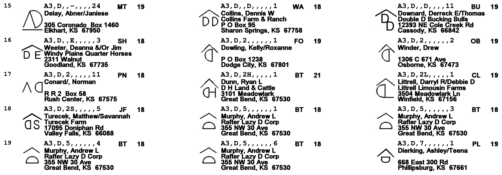
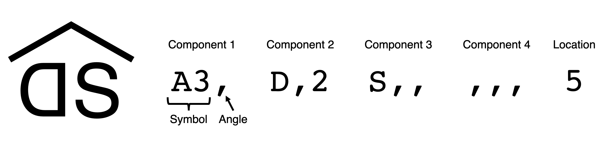
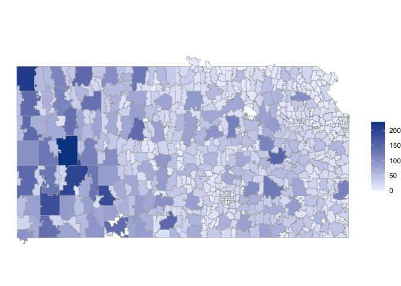
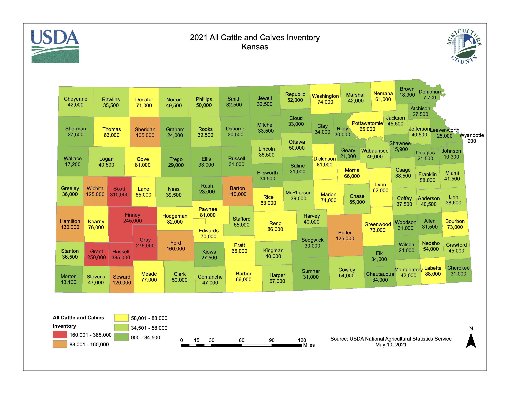

Cattle Brand Data Pipeline
================
Mason Youngblood

The Kansas cattle brand books, available from the [state
library](https://cdm16884.contentdm.oclc.org/digital/collection/p16884coll5/id/317/rec/2),
log all of the brands registered in the state since 1941. Starting in
1990, Kansas began to use a coding system to catalog all of their cattle
brands. Below are the editions that include this coding system:

-   1990 (9th edition) \[scan\]
-   1998 (10th edition) \[scan\]
-   2003 (11th edition) \[scan\]
-   2008 (12th edition) \[PDF\]
-   2014 (13th edition) \[PDF\]
-   2015 (14th edition) \[PDF\]
-   2016 (15th edition) \[PDF\]

This coding system includes information on the components that make up
each brand (i.e. letters, numbers, symbols), their angle of rotation,
and the location of the brand on the animal. Unfortunately, after 2016
the state moved to an [online
database](https://www.kellysolutions.com/KS/Brands/searchbrands.asp)
that does not include the cattle brand codes. Below is an example of the
brand book format (page 60 of 2016).

 

<center>

</center>

 

Each brand code is composed of 13 digits: four sets of three digits that
correspond to the components of the brand, and a final digit that
indicates the location of the brand on the animal (see below). Some
components are a single digit (e.g. “D” and “S” below), while others are
two (e.g. “A3” is the caret below) or three. For one- and two-digit
components, the third digit corresponds to the angle of rotation of the
symbol. When multiple brands have the same set of components in
different relative positions, the 12th digit is used to distinguish
between the different versions. A detailed description of the coding
system, as well as an index of all possible components of brands, can be
found in the introduction of each of the cattle brand books.

<center>

</center>

1990, 1998, and 2003 are scans of the printed books, and thus have noise
and artifacts that interfere with optical character recognition (OCR).
As such, we chose to manually extract the cattle brands and zip codes
from these first three books by hand (*in progress*). 2008, 2014, 2015,
and 2016, on the other hand, are the original PDF files. We chose to
automatically extract the cattle brands and zip codes from these latter
four books using [Tesseract OCR](https://tesseract-ocr.github.io/)
([version
4.1.1](https://github.com/tesseract-ocr/tesseract/releases/tag/4.1.1),
compiled
[manually](https://tesseract-ocr.github.io/tessdoc/Compiling.html#macos)).

Two custom long short-term memory (LSTM) neural networks were separately
[trained](https://tesseract-ocr.github.io/tessdoc/tess4/TrainingTesseract-4.00.html)
to recognize (1) cattle brand codes and (2) zip codes:

1.  The training dataset for the cattle brand codes included 3,134
    currently registered brands (via personal correspondence with
    [Kansas’ Brands
    Program](https://agriculture.ks.gov/divisions-programs/division-of-animal-health/brands-program))
    as well as 500,000 simulated brands based on the possible components
    outlined in the brand books. Training data was rendered in Courier
    with the following exposures: -2, -1, 0, 1, 2. The base
    English-language LSTM was trained for an additional 5,000 iterations
    using this training data. To further improve accuracy we provided
    this model with a dictionary containing all of the possible brand
    components, a set of regular expressions matching the full structure
    of possible brand codes, and we whitelisted only the characters
    included in the index of each brand book.
2.  The training dataset for the zip codes included all 757 zip codes in
    Kansas with the state and city, in the same format as in the brand
    books (e.g. “Bonner Springs, KS 66012”). Training data was rendered
    in Helvetica with the following exposures: 0, 1, 2, 3. The base
    English-language LSTM was trained for an additional 5,000 iterations
    using this training data. To further improve accuracy we provided
    this model with a dictionary containing all of the zip codes in
    Kansas and abbreviations for all US states and corresponding regular
    expressions.

Prior to OCR, all images were manually removed from the brand books
using Adobe Acrobat, and all pages were converted to 300 DPI PNG files
(same resolution as the training data). OCR was conducted twice for each
page, using both the cattle brand LSTM and the zip code LSTM. A series
of regular expressions were then used to extract the cattle brands and
zip codes from the raw OCR output. Pages that did not result in 57
brands and zip codes (19 rows x 3 columns) were manually corrected. Most
errors in OCR were caused by mis-specified brand codes that had an extra
component or special characters not included in the index of the brand
book. After all data was compiled for each year, we manually corrected
any zip codes that did not match a real zip code from a US state or
territory. A random subset of 500 brand codes (exported as
*brands\_to\_check.csv*) will be manually checked by another member of
the research team to estimate the accuracy of the OCR pipeline. The
result of OCR is a combined dataframe of cattle brands and zip codes
with the corresponding pages and years (example below).

``` r
#load brand data
load("brand_data.RData")

#print first 20 rows
brand_data[1:20,]
```

    ##            brand location page year
    ## 1  #,,,,,,,,,,,1    67563    1 2008
    ## 2  #,,,,,,,,,,11    67835    1 2008
    ## 3  #,,,,,,,,,,13    67880    1 2008
    ## 4  $,,,,,,,,,,11    67104    1 2008
    ## 5  $,,,,,,,,,,13    66428    1 2008
    ## 6  $,,,,,,,,,,15    67869    1 2008
    ## 7  $,,,,,,,,,,16    67664    1 2008
    ## 8  $,,-,,,,,,,,1    67530    1 2008
    ## 9  $,2,,,,,,,,,1    67659    1 2008
    ## 10 %,,,,,,,,,,,2    67529    1 2008
    ## 11 (,,(,,,,,,,,1    66548    1 2008
    ## 12 (,,(,,7,,,,,5    67862    1 2008
    ## 13 (,,),,),,,,,1    67333    1 2008
    ## 14 (,,),,,,,,,,1    67745    1 2008
    ## 15 (,,),,,,,,,,2    67745    1 2008
    ## 16 (,,),,,,,,,,5    67745    1 2008
    ## 17 (,,),,,,,,,13    67052    1 2008
    ## 18 (,,),,,,,,,15    67745    1 2008
    ## 19 (,,),,I,,-,,2    67871    1 2008
    ## 20 (,,),,M,,,,,1    67546    1 2008

Once the cattle brands and zip codes from 1990, 1998, and 2003 have been
collected they will be added to this combined dataframe. For now, the
details below only related to the data from 2008-2016.

``` r
#load zip code data
library(zipcodeR)
zip_codes <- zipcodeR::zip_code_db

#store unique brands
unique_brand_data <- brand_data[-which(duplicated(brand_data$brand)), ]
```

There are 20,981 unique brands in the dataset (not accounting for the
position of the brands on the animals, so the final number will be
smaller).

``` r
#states of brands
states <- sort(table(zip_codes$state[match(unique_brand_data$location, zip_codes$zipcode)]), decreasing = TRUE)
states
```

    ## 
    ##    KS    CO    NE    OK    TX    MO    AZ    NM    WY    CA    SD    MT    IA 
    ## 20093   172   166   152   120    52    22    21    21    18    15    14    12 
    ##    ID    IN    AR    FL    IL    TN    VA    GA    ND    MS    PA    AK    LA 
    ##    11     8     7     7     7     7     6     5     5     4     4     3     3 
    ##    MN    NC    NV    AL    KY    UT    WI    HI    MD    MI    NY    OH    OR 
    ##     3     3     3     2     2     2     2     1     1     1     1     1     1 
    ##    SC    WA    WV 
    ##     1     1     1

95.8% of brands are registered in the state of Kansas. Out-of-state
brands will be excluded from the rest of the analysis. Below is the
distribution of brands within the state of Kansas.

``` r
#get zip code data for plotting
library(choroplethrZip)
data("zip.regions")
kansas_zips <- unique(zip.regions$region[which(zip.regions$state.name == "kansas")])

#get number of brands in each zip code
zip_data <- data.frame(region = kansas_zips, value = sapply(1:length(kansas_zips), function(x){length(which(unique_brand_data$location == kansas_zips[x]))}))

#plot heat map
par(mar = c(0, 0, 0, 0))
zip_choropleth(zip_data, num_colors = 1, state_zoom = "kansas")
```



This distribution is roughly consistent with the most recent cattle
inventory of the state (shown below). The most important thing to note
is that brand registrations do not cluster around the highest (human)
population density parts of the state such as Topeka and Kansas City (in
the northeast), which would suggest that they are not registered where
they are actively used by ranchers.

<center>

</center>
